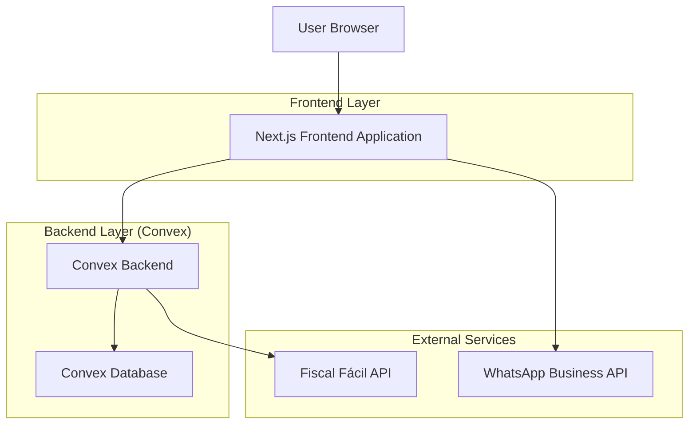
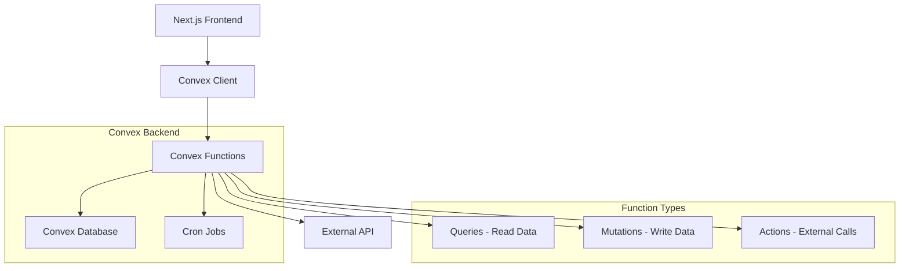
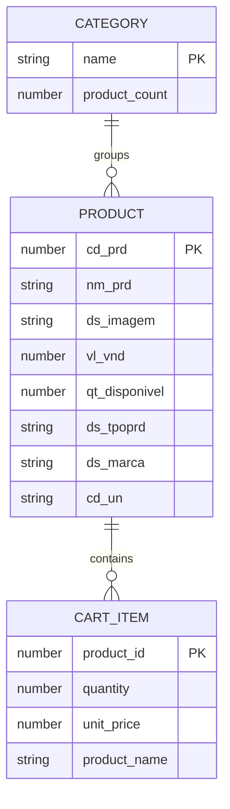

# Arquitetura Técnica - Site Distribuidora Mirô

## 1. Architecture design



## 2. Technology Description

* Frontend: Next.js\@14 + TypeScript + Tailwind CSS + App Router

* Backend: Convex (serverless backend na nuvem)

* Database: Convex Database (NoSQL integrado)

* State Management: Convex React hooks para real-time data

* Build Tool: Next.js com otimizações para produção

* Deployment: Vercel (frontend) + Convex Cloud (backend)

## 3. Route definitions

| Route        | Purpose                                             |
| ------------ | --------------------------------------------------- |
| /            | Home page com hero section e categorias em destaque |
| /catalogo    | Catálogo completo de produtos com filtros e busca   |
| /produto/:id | Página de detalhes do produto específico            |
| /carrinho    | Carrinho de compras com lista de itens selecionados |
| /sobre       | Informações institucionais da Distribuidora Mirô    |

## 4. Convex Backend Architecture

### 4.1 Schemas (convex/schema.ts)

```typescript
import { defineSchema, defineTable } from "convex/server";
import { v } from "convex/values";

export default defineSchema({
  products: defineTable({
    externalId: v.number(), // cd_prd da API externa
    name: v.string(), // nm_prd
    image: v.string(), // ds_imagem
    price: v.number(), // vl_vnd
    availableQuantity: v.number(), // qt_disponivel
    category: v.string(), // ds_tpoprd
    brand: v.string(), // ds_marca
    unit: v.string(), // cd_un
    description: v.optional(v.string()),
    isActive: v.boolean(),
    lastSyncAt: v.number(), // timestamp da última sincronização
  })
    .index("by_external_id", ["externalId"])
    .index("by_category", ["category"])
    .index("by_active", ["isActive"]),

  categories: defineTable({
    name: v.string(),
    productCount: v.number(),
    isActive: v.boolean(),
  }).index("by_active", ["isActive"]),

  cart_sessions: defineTable({
    sessionId: v.string(),
    items: v.array(
      v.object({
        productId: v.id("products"),
        quantity: v.number(),
        unitPrice: v.number(),
      })
    ),
    total: v.number(),
    createdAt: v.number(),
    updatedAt: v.number(),
  }).index("by_session", ["sessionId"]),

  sync_logs: defineTable({
    type: v.string(), // "products", "categories"
    status: v.string(), // "success", "error"
    recordsProcessed: v.number(),
    errorMessage: v.optional(v.string()),
    syncedAt: v.number(),
  }).index("by_type_and_date", ["type", "syncedAt"]),
});
```

### 4.2 External API Integration

**Integração com Fiscal Fácil**

```
GET https://fiscalfacil.com/LojaVirtual/14044/produtos/
```

Response:

| Param Name     | Param Type | Description                      |
| -------------- | ---------- | -------------------------------- |
| dados          | array      | Lista de produtos disponíveis    |
| cd\_prd        | number     | ID único do produto              |
| nm\_prd        | string     | Nome completo do produto         |
| ds\_imagem     | string     | URL da imagem do produto         |
| vl\_vnd        | number     | Preço de venda unitário          |
| qt\_disponivel | number     | Quantidade disponível em estoque |
| ds\_tpoprd     | string     | Categoria/tipo do produto        |
| ds\_marca      | string     | Marca do produto                 |
| cd\_un         | string     | Unidade de medida (UN, KG, etc.) |

Example Response:

```json
{
  "dados": [
    {
      "cd_prd": 11167,
      "nm_prd": "ABRACADEIRA DE NYLON C/100 2,5 X 150 MM",
      "ds_imagem": "https://storage.googleapis.com/...",
      "vl_vnd": 4.62,
      "qt_disponivel": 108,
      "ds_tpoprd": "FERRAMENTAS",
      "ds_marca": "FRATELLI",
      "cd_un": "UN"
    }
  ]
}
```

### 4.3 Mutations (convex/mutations/)

**Sincronização de Produtos (convex/mutations/syncProducts.ts)**

```typescript
import { mutation } from "../_generated/server";
import { v } from "convex/values";

export const syncProductsFromExternalAPI = mutation({
  args: {},
  handler: async (ctx) => {
    try {
      const response = await fetch("https://fiscalfacil.com/LojaVirtual/14044/produtos/");
      const data = await response.json();

      let processedCount = 0;

      for (const apiProduct of data.dados) {
        const existing = await ctx.db
          .query("products")
          .withIndex("by_external_id", (q) => q.eq("externalId", apiProduct.cd_prd))
          .first();

        const productData = {
          externalId: apiProduct.cd_prd,
          name: apiProduct.nm_prd,
          image: apiProduct.ds_imagem,
          price: apiProduct.vl_vnd,
          availableQuantity: apiProduct.qt_disponivel,
          category: apiProduct.ds_tpoprd,
          brand: apiProduct.ds_marca,
          unit: apiProduct.cd_un,
          isActive: apiProduct.qt_disponivel > 0,
          lastSyncAt: Date.now(),
        };

        if (existing) {
          await ctx.db.patch(existing._id, productData);
        } else {
          await ctx.db.insert("products", productData);
        }
        processedCount++;
      }

      // Log da sincronização
      await ctx.db.insert("sync_logs", {
        type: "products",
        status: "success",
        recordsProcessed: processedCount,
        syncedAt: Date.now(),
      });

      return { success: true, processed: processedCount };
    } catch (error) {
      await ctx.db.insert("sync_logs", {
        type: "products",
        status: "error",
        recordsProcessed: 0,
        errorMessage: error.message,
        syncedAt: Date.now(),
      });
      throw error;
    }
  },
});
```

**Operações de Carrinho (convex/mutations/cart.ts)**

```typescript
export const addToCart = mutation({
  args: {
    sessionId: v.string(),
    productId: v.id("products"),
    quantity: v.number(),
  },
  handler: async (ctx, { sessionId, productId, quantity }) => {
    const product = await ctx.db.get(productId);
    if (!product) throw new Error("Produto não encontrado");

    const existingCart = await ctx.db
      .query("cart_sessions")
      .withIndex("by_session", (q) => q.eq("sessionId", sessionId))
      .first();

    if (existingCart) {
      const existingItemIndex = existingCart.items.findIndex(
        (item) => item.productId === productId
      );

      if (existingItemIndex >= 0) {
        existingCart.items[existingItemIndex].quantity += quantity;
      } else {
        existingCart.items.push({
          productId,
          quantity,
          unitPrice: product.price,
        });
      }

      const total = existingCart.items.reduce(
        (sum, item) => sum + item.quantity * item.unitPrice,
        0
      );

      await ctx.db.patch(existingCart._id, {
        items: existingCart.items,
        total,
        updatedAt: Date.now(),
      });
    } else {
      await ctx.db.insert("cart_sessions", {
        sessionId,
        items: [{ productId, quantity, unitPrice: product.price }],
        total: quantity * product.price,
        createdAt: Date.now(),
        updatedAt: Date.now(),
      });
    }
  },
});
```

### 4.4 Queries (convex/queries/)

**Busca de Produtos (convex/queries/products.ts)**

```typescript
import { query } from "../_generated/server";
import { v } from "convex/values";

export const getAllProducts = query({
  args: {
    category: v.optional(v.string()),
    search: v.optional(v.string()),
    sortBy: v.optional(v.string()),
    limit: v.optional(v.number()),
  },
  handler: async (ctx, { category, search, sortBy = "name", limit = 50 }) => {
    let query = ctx.db.query("products").withIndex("by_active", (q) => q.eq("isActive", true));

    if (category) {
      query = ctx.db.query("products").withIndex("by_category", (q) => q.eq("category", category));
    }

    let products = await query.take(limit);

    if (search) {
      products = products.filter(
        (product) =>
          product.name.toLowerCase().includes(search.toLowerCase()) ||
          product.brand.toLowerCase().includes(search.toLowerCase())
      );
    }

    // Ordenação
    if (sortBy === "price") {
      products.sort((a, b) => a.price - b.price);
    } else if (sortBy === "name") {
      products.sort((a, b) => a.name.localeCompare(b.name));
    }

    return products;
  },
});

export const getProductById = query({
  args: { id: v.id("products") },
  handler: async (ctx, { id }) => {
    return await ctx.db.get(id);
  },
});

export const getCategories = query({
  args: {},
  handler: async (ctx) => {
    return await ctx.db
      .query("categories")
      .withIndex("by_active", (q) => q.eq("isActive", true))
      .collect();
  },
});
```

**Carrinho (convex/queries/cart.ts)**

```typescript
export const getCart = query({
  args: { sessionId: v.string() },
  handler: async (ctx, { sessionId }) => {
    const cart = await ctx.db
      .query("cart_sessions")
      .withIndex("by_session", (q) => q.eq("sessionId", sessionId))
      .first();

    if (!cart) return null;

    // Buscar detalhes dos produtos
    const itemsWithDetails = await Promise.all(
      cart.items.map(async (item) => {
        const product = await ctx.db.get(item.productId);
        return {
          ...item,
          product,
        };
      })
    );

    return {
      ...cart,
      items: itemsWithDetails,
    };
  },
});
```

### 4.5 Cron Jobs (convex/crons.ts)

```typescript
import { cronJobs } from "convex/server";
import { internal } from "./_generated/api";

const crons = cronJobs();

// Sincronização automática a cada 5 minutos
crons.interval(
  "sync products",
  { minutes: 5 },
  internal.mutations.syncProducts.syncProductsFromExternalAPI
);

// Limpeza de carrinho abandonado (24h)
crons.interval(
  "cleanup abandoned carts",
  { hours: 24 },
  internal.mutations.cart.cleanupAbandonedCarts
);

export default crons;
```

## 5. Convex Architecture Diagram



**Integração com Fiscal Fácil**

```
GET https://fiscalfacil.com/LojaVirtual/14044/produtos/
```

Response:

| Param Name     | Param Type | Description                      |
| -------------- | ---------- | -------------------------------- |
| dados          | array      | Lista de produtos disponíveis    |
| cd\_prd        | number     | ID único do produto              |
| nm\_prd        | string     | Nome completo do produto         |
| ds\_imagem     | string     | URL da imagem do produto         |
| vl\_vnd        | number     | Preço de venda unitário          |
| qt\_disponivel | number     | Quantidade disponível em estoque |
| ds\_tpoprd     | string     | Categoria/tipo do produto        |
| ds\_marca      | string     | Marca do produto                 |
| cd\_un         | string     | Unidade de medida (UN, KG, etc.) |

Example Response:

```json
{
  "dados": [
    {
      "cd_prd": 11167,
      "nm_prd": "ABRACADEIRA DE NYLON C/100 2,5 X 150 MM",
      "ds_imagem": "https://storage.googleapis.com/...",
      "vl_vnd": 4.62,
      "qt_disponivel": 108,
      "ds_tpoprd": "FERRAMENTAS",
      "ds_marca": "FRATELLI",
      "cd_un": "UN"
    }
  ]
}
```

### 4.3 Mutations (convex/mutations/)

**Sincronização de Produtos (convex/mutations/syncProducts.ts)**

```typescript
import { mutation } from "../_generated/server";
import { v } from "convex/values";

export const syncProductsFromExternalAPI = mutation({
  args: {},
  handler: async (ctx) => {
    try {
      const response = await fetch("https://fiscalfacil.com/LojaVirtual/14044/produtos/");
      const data = await response.json();

      let processedCount = 0;

      for (const apiProduct of data.dados) {
        const existing = await ctx.db
          .query("products")
          .withIndex("by_external_id", (q) => q.eq("externalId", apiProduct.cd_prd))
          .first();

        const productData = {
          externalId: apiProduct.cd_prd,
          name: apiProduct.nm_prd,
          image: apiProduct.ds_imagem,
          price: apiProduct.vl_vnd,
          availableQuantity: apiProduct.qt_disponivel,
          category: apiProduct.ds_tpoprd,
          brand: apiProduct.ds_marca,
          unit: apiProduct.cd_un,
          isActive: apiProduct.qt_disponivel > 0,
          lastSyncAt: Date.now(),
        };

        if (existing) {
          await ctx.db.patch(existing._id, productData);
        } else {
          await ctx.db.insert("products", productData);
        }
        processedCount++;
      }

      // Log da sincronização
      await ctx.db.insert("sync_logs", {
        type: "products",
        status: "success",
        recordsProcessed: processedCount,
        syncedAt: Date.now(),
      });

      return { success: true, processed: processedCount };
    } catch (error) {
      await ctx.db.insert("sync_logs", {
        type: "products",
        status: "error",
        recordsProcessed: 0,
        errorMessage: error.message,
        syncedAt: Date.now(),
      });
      throw error;
    }
  },
});
```

**Operações de Carrinho (convex/mutations/cart.ts)**

```typescript
export const addToCart = mutation({
  args: {
    sessionId: v.string(),
    productId: v.id("products"),
    quantity: v.number(),
  },
  handler: async (ctx, { sessionId, productId, quantity }) => {
    const product = await ctx.db.get(productId);
    if (!product) throw new Error("Produto não encontrado");

    const existingCart = await ctx.db
      .query("cart_sessions")
      .withIndex("by_session", (q) => q.eq("sessionId", sessionId))
      .first();

    if (existingCart) {
      const existingItemIndex = existingCart.items.findIndex(
        (item) => item.productId === productId
      );

      if (existingItemIndex >= 0) {
        existingCart.items[existingItemIndex].quantity += quantity;
      } else {
        existingCart.items.push({
          productId,
          quantity,
          unitPrice: product.price,
        });
      }

      const total = existingCart.items.reduce(
        (sum, item) => sum + item.quantity * item.unitPrice,
        0
      );

      await ctx.db.patch(existingCart._id, {
        items: existingCart.items,
        total,
        updatedAt: Date.now(),
      });
    } else {
      await ctx.db.insert("cart_sessions", {
        sessionId,
        items: [{ productId, quantity, unitPrice: product.price }],
        total: quantity * product.price,
        createdAt: Date.now(),
        updatedAt: Date.now(),
      });
    }
  },
});
```

**WhatsApp Integration**

```
GET https://wa.me/{phone}?text={encoded_message}
```

Request:

| Param Name | Param Type | isRequired | Description                        |
| ---------- | ---------- | ---------- | ---------------------------------- |
| phone      | string     | true       | Número do vendedor (556799601031) |
| text       | string     | true       | Mensagem formatada com pedido      |

## 5. Data model

### 5.1 Data model definition



### 5.2 TypeScript Interfaces

```typescript
// Produto da API
interface ApiProduct {
  cd_prd: number;
  cd_un: string;
  ds_temfoto: string;
  ds_promocao: string;
  controlaestoque: number;
  vl_promocao: number;
  ds_imagem: string;
  vl_vnd: number;
  qt_prd: number;
  qt_disponivel: number;
  cd_tpoprd: number;
  ds_tpoprd: string;
  nr_prioridade: number;
  estoques: any[];
  vl_percdesconto: number;
  ds_caracteristica: string;
  ds_marca: string;
  nm_prd: string;
  ds_obssite: string;
}

// Produto normalizado para o frontend
interface Product {
  id: number;
  name: string;
  image: string;
  price: number;
  availableQuantity: number;
  category: string;
  brand: string;
  unit: string;
  description?: string;
}

// Item do carrinho
interface CartItem {
  productId: number;
  name: string;
  image: string;
  price: number;
  quantity: number;
  unit: string;
}

// Estado do carrinho
interface CartState {
  items: CartItem[];
  total: number;
  addItem: (product: Product, quantity: number) => void;
  removeItem: (productId: number) => void;
  updateQuantity: (productId: number, quantity: number) => void;
  clearCart: () => void;
  generateWhatsAppMessage: () => string;
}

// Filtros de busca
interface ProductFilters {
  category?: string;
  search?: string;
  minPrice?: number;
  maxPrice?: number;
  sortBy?: "name" | "price" | "category";
  sortOrder?: "asc" | "desc";
}
```

## 6. Performance e Otimizações

### 6.1 Estratégias de Cache

* **API Cache**: Cache de 5 minutos para dados de produtos

* **Image Optimization**: Lazy loading e WebP quando suportado

* **Bundle Splitting**: Code splitting por rotas

* **Service Worker**: Cache de assets estáticos

### 6.2 SEO e Acessibilidade

* **Meta Tags**: Dinâmicas por produto e categoria

* **Structured Data**: Schema.org para produtos

* **ARIA Labels**: Navegação acessível

* **Semantic HTML**: Estrutura semântica correta

### 6.3 Monitoramento

* **Analytics**: Google Analytics 4 para conversões

* **Performance**: Web Vitals tracking

* **Error Tracking**: Sentry para erros em produção

* **A/B Testing**: Otimização de conversão

## 7. Deployment e CI/CD

### 7.1 Build Process

```bash
# Desenvolvimento
npm run dev          # Next.js dev server
npx convex dev       # Convex dev environment

# Build para produção
npm run build        # Build Next.js
npx convex deploy    # Deploy Convex functions

# Testes
npm run test
npm run test:e2e
```

### 7.2 Environment Variables

**Frontend (.env.local)**

```env
# Convex
NEXT_PUBLIC_CONVEX_URL=https://your-deployment.convex.cloud

# WhatsApp
NEXT_PUBLIC_WHATSAPP_NUMBER=556799601031

# Analytics
NEXT_PUBLIC_GA_TRACKING_ID=G-XXXXXXXXXX
NEXT_PUBLIC_SENTRY_DSN=https://xxx@sentry.io/xxx
```

**Convex (convex/.env)**

```env
# API Externa
FISCAL_FACIL_API_URL=https://fiscalfacil.com/LojaVirtual/14044/produtos/

# Configurações de sincronização
SYNC_INTERVAL_MINUTES=5
CLEANUP_INTERVAL_HOURS=24
```

### 7.3 Deployment Strategy

**Convex Backend**

* **Development**: `npx convex dev` para ambiente local

* **Production**: `npx convex deploy --prod` para produção

* **Rollback**: Convex mantém histórico de deployments

* **Monitoring**: Dashboard Convex para logs e métricas

**Next.js Frontend**

* **Staging**: Deploy automático em PRs via Vercel

* **Production**: Deploy manual após aprovação

* **CDN**: Assets servidos via Vercel Edge Network

* **Environment**: Variáveis configuradas no Vercel Dashboard

### 7.4 Convex Configuration (convex.json)

```json
{
  "functions": "convex/",
  "generateCommonJSApi": false,
  "node": {
    "externalPackages": ["node-fetch"]
  }
}
```

