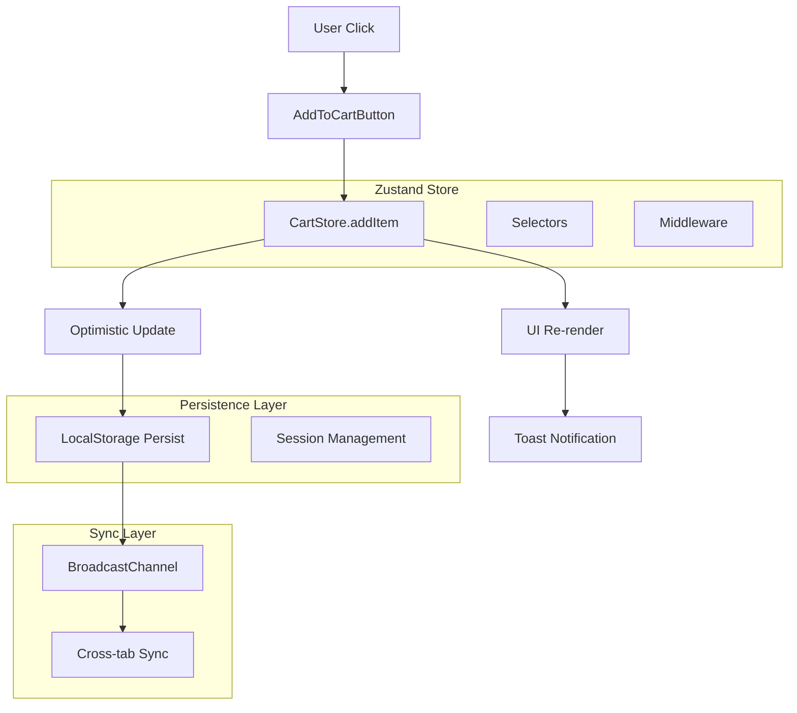

# Guia de Implementação: Correção do Sistema de Carrinho

## 1. Análise do Código Atual

### 1.1 Problemas Críticos Identificados

#### useCartLocal.ts - Problemas Estruturais
```typescript
// PROBLEMA 1: Closures obsoletas
const addToCart = useCallback(async (externalId: string, quantity: number = 1) => {
  // sessionId removido das dependências causa stale closures
}, []); // ❌ Dependências vazias

// PROBLEMA 2: triggerUpdate ineficiente
const triggerUpdate = useCallback(() => {
  setForceUpdate(prev => prev + 1); // ❌ Força re-render
  setLastUpdate(Date.now());
  
  if (typeof window !== 'undefined') {
    window.dispatchEvent(new CustomEvent('cartUpdated')); // ❌ Não debounced
  }
}, []);

// PROBLEMA 3: getOrCreateSessionId chamado excessivamente
const sessionIdRef = useRef<string>('');
useEffect(() => {
  const initializeCart = async () => {
    const sessionId = getOrCreateSessionId(); // ❌ Chamado múltiplas vezes
    sessionIdRef.current = sessionId;
    await loadCartFromStorage(sessionId);
  };
  initializeCart();
}, []); // ❌ Pode executar múltiplas vezes no StrictMode
```

#### Header.tsx - Hack de Force Update
```typescript
// PROBLEMA: Hack ineficiente para forçar re-render
const [forceUpdate, setForceUpdate] = useState(0);
const cartItemsCount = (cart?.totalItems || 0) + forceUpdate * 0; // ❌ Multiplicação por 0

// Listener não otimizado
useEffect(() => {
  const handleCartUpdate = () => {
    setForceUpdate((prev) => prev + 1); // ❌ Re-render desnecessário
  };
  
  if (typeof window !== "undefined") {
    window.addEventListener("cartUpdated", handleCartUpdate);
    return () => window.removeEventListener("cartUpdated", handleCartUpdate);
  }
}, []);
```

### 1.2 Race Conditions Detectadas

```typescript
// ProductCard.tsx - Potencial race condition
const handleAddToCart = async () => {
  setIsAdding(true);
  
  try {
    await addToCart(product.externalId, quantity); // ❌ Múltiplos cliques podem causar duplicatas
    toast.success(`${quantity} item(s) adicionado(s) ao carrinho!`);
    setQuantity(1);
  } catch (error) {
    toast.error(error.message);
  } finally {
    setIsAdding(false); // ❌ Estado pode ser inconsistente
  }
};
```

## 2. Solução Implementada: Migração para Zustand

### 2.1 Nova Arquitetura



### 2.2 CartStore Completo

```typescript
// stores/cartStore.ts
import { create } from 'zustand'
import { persist, createJSONStorage } from 'zustand/middleware'
import { subscribeWithSelector } from 'zustand/middleware'
import { immer } from 'zustand/middleware/immer'

// Types
interface CartItem {
  id: string
  externalId: string
  name: string
  price: number
  quantity: number
  image?: string
  brand?: string
  category?: string
  maxQuantity?: number
}

interface CartState {
  items: CartItem[]
  totalItems: number
  totalAmount: number
  sessionId: string
  isLoading: boolean
  error: string | null
  lastUpdated: number
}

interface CartActions {
  // Core actions
  addItem: (product: Omit<CartItem, 'quantity' | 'id'>, quantity?: number) => Promise<void>
  removeItem: (externalId: string) => void
  updateQuantity: (externalId: string, quantity: number) => void
  clearCart: () => void
  
  // State management
  setLoading: (loading: boolean) => void
  setError: (error: string | null) => void
  
  // Utilities
  getItem: (externalId: string) => CartItem | undefined
  hasItem: (externalId: string) => boolean
  validateStock: (externalId: string, requestedQuantity: number) => boolean
}

type CartStore = CartState & CartActions

// Utilities
const calculateTotals = (items: CartItem[]) => ({
  totalItems: items.reduce((sum, item) => sum + item.quantity, 0),
  totalAmount: items.reduce((sum, item) => sum + (item.price * item.quantity), 0)
})

const generateSessionId = () => {
  const timestamp = Date.now()
  const random = Math.random().toString(36).substr(2, 9)
  return `cart_${timestamp}_${random}`
}

const generateItemId = (externalId: string) => {
  return `${externalId}_${Date.now()}_${Math.random().toString(36).substr(2, 5)}`
}

// Store implementation
export const useCartStore = create<CartStore>()()
  subscribeWithSelector(
    persist(
      immer((set, get) => ({
        // Initial state
        items: [],
        totalItems: 0,
        totalAmount: 0,
        sessionId: generateSessionId(),
        isLoading: false,
        error: null,
        lastUpdated: Date.now(),

        // Actions
        addItem: async (product, quantity = 1) => {
          // Validation
          if (quantity <= 0) {
            throw new Error('Quantidade deve ser maior que zero')
          }
          
          if (product.maxQuantity && quantity > product.maxQuantity) {
            throw new Error(`Quantidade máxima: ${product.maxQuantity}`)
          }

          set((state) => {
            state.isLoading = true
            state.error = null
          })

          try {
            await new Promise(resolve => setTimeout(resolve, 50)) // Simulate API delay
            
            set((state) => {
              const existingItemIndex = state.items.findIndex(
                item => item.externalId === product.externalId
              )

              if (existingItemIndex >= 0) {
                // Update existing item
                const existingItem = state.items[existingItemIndex]
                const newQuantity = existingItem.quantity + quantity
                
                if (product.maxQuantity && newQuantity > product.maxQuantity) {
                  throw new Error(`Quantidade máxima: ${product.maxQuantity}`)
                }
                
                state.items[existingItemIndex].quantity = newQuantity
              } else {
                // Add new item
                const newItem: CartItem = {
                  ...product,
                  id: generateItemId(product.externalId),
                  quantity
                }
                state.items.push(newItem)
              }

              // Recalculate totals
              const totals = calculateTotals(state.items)
              state.totalItems = totals.totalItems
              state.totalAmount = totals.totalAmount
              state.lastUpdated = Date.now()
              state.isLoading = false
            })

            // Broadcast to other tabs
            if (typeof window !== 'undefined') {
              window.dispatchEvent(new CustomEvent('cart:updated', {
                detail: { 
                  action: 'add', 
                  product, 
                  quantity,
                  timestamp: Date.now()
                }
              }))
            }
          } catch (error) {
            set((state) => {
              state.error = error instanceof Error ? error.message : 'Erro ao adicionar item'
              state.isLoading = false
            })
            throw error
          }
        },

        removeItem: (externalId) => {
          set((state) => {
            const itemIndex = state.items.findIndex(item => item.externalId === externalId)
            
            if (itemIndex >= 0) {
              state.items.splice(itemIndex, 1)
              
              const totals = calculateTotals(state.items)
              state.totalItems = totals.totalItems
              state.totalAmount = totals.totalAmount
              state.lastUpdated = Date.now()
            }
          })

          if (typeof window !== 'undefined') {
            window.dispatchEvent(new CustomEvent('cart:updated', {
              detail: { 
                action: 'remove', 
                externalId,
                timestamp: Date.now()
              }
            }))
          }
        },

        updateQuantity: (externalId, quantity) => {
          if (quantity <= 0) {
            get().removeItem(externalId)
            return
          }

          set((state) => {
            const itemIndex = state.items.findIndex(item => item.externalId === externalId)
            
            if (itemIndex >= 0) {
              const item = state.items[itemIndex]
              
              if (item.maxQuantity && quantity > item.maxQuantity) {
                state.error = `Quantidade máxima: ${item.maxQuantity}`
                return
              }
              
              state.items[itemIndex].quantity = quantity
              
              const totals = calculateTotals(state.items)
              state.totalItems = totals.totalItems
              state.totalAmount = totals.totalAmount
              state.lastUpdated = Date.now()
              state.error = null
            }
          })

          if (typeof window !== 'undefined') {
            window.dispatchEvent(new CustomEvent('cart:updated', {
              detail: { 
                action: 'update', 
                externalId, 
                quantity,
                timestamp: Date.now()
              }
            }))
          }
        },

        clearCart: () => {
          set((state) => {
            state.items = []
            state.totalItems = 0
            state.totalAmount = 0
            state.sessionId = generateSessionId()
            state.error = null
            state.lastUpdated = Date.now()
          })

          if (typeof window !== 'undefined') {
            window.dispatchEvent(new CustomEvent('cart:updated', {
              detail: { 
                action: 'clear',
                timestamp: Date.now()
              }
            }))
          }
        },

        // State management
        setLoading: (isLoading) => set((state) => {
          state.isLoading = isLoading
        }),
        
        setError: (error) => set((state) => {
          state.error = error
        }),

        // Utilities
        getItem: (externalId) => {
          return get().items.find(item => item.externalId === externalId)
        },
        
        hasItem: (externalId) => {
          return get().items.some(item => item.externalId === externalId)
        },
        
        validateStock: (externalId, requestedQuantity) => {
          const item = get().getItem(externalId)
          if (!item) return true
          
          const totalQuantity = item.quantity + requestedQuantity
          return !item.maxQuantity || totalQuantity <= item.maxQuantity
        }
      })),
      {
        name: 'cart-storage',
        storage: createJSONStorage(() => localStorage),
        partialize: (state) => ({
          items: state.items,
          sessionId: state.sessionId,
          totalItems: state.totalItems,
          totalAmount: state.totalAmount,
          lastUpdated: state.lastUpdated
        }),
        version: 1,
        migrate: (persistedState: any, version: number) => {
          // Handle migrations if needed
          if (version === 0) {
            // Migrate from old structure
            return {
              ...persistedState,
              lastUpdated: Date.now()
            }
          }
          return persistedState
        }
      }
    )
  )

// Optimized selectors
export const useCartItems = () => useCartStore(state => state.items)
export const useCartTotals = () => useCartStore(state => ({
  totalItems: state.totalItems,
  totalAmount: state.totalAmount
}))
export const useCartLoading = () => useCartStore(state => state.isLoading)
export const useCartError = () => useCartStore(state => state.error)
export const useCartSessionId = () => useCartStore(state => state.sessionId)
export const useCartLastUpdated = () => useCartStore(state => state.lastUpdated)

// Compound selectors
export const useCartItemCount = (externalId: string) => 
  useCartStore(state => {
    const item = state.items.find(item => item.externalId === externalId)
    return item?.quantity || 0
  })

export const useCartItemExists = (externalId: string) => 
  useCartStore(state => state.items.some(item => item.externalId === externalId))

export const useCartIsEmpty = () => 
  useCartStore(state => state.items.length === 0)

export const useCartActions = () => useCartStore(state => ({
  addItem: state.addItem,
  removeItem: state.removeItem,
  updateQuantity: state.updateQuantity,
  clearCart: state.clearCart,
  setLoading: state.setLoading,
  setError: state.setError
}))
```

### 2.3 Cross-Tab Synchronization

```typescript
// hooks/useCartSync.ts
"use client"

import { useEffect, useRef } from 'react'
import { useCartStore } from '@/stores/cartStore'

interface CartSyncMessage {
  type: 'CART_UPDATED' | 'CART_CLEARED' | 'CART_SYNC_REQUEST'
  data?: any
  timestamp: number
  tabId: string
}

export function useCartSync() {
  const channelRef = useRef<BroadcastChannel | null>(null)
  const tabIdRef = useRef<string>(`tab_${Date.now()}_${Math.random().toString(36).substr(2, 9)}`)
  const lastSyncRef = useRef<number>(0)
  
  useEffect(() => {
    if (typeof window === 'undefined') return
    
    // Create broadcast channel
    channelRef.current = new BroadcastChannel('cart-sync')
    const channel = channelRef.current
    
    // Handle messages from other tabs
    const handleMessage = (event: MessageEvent<CartSyncMessage>) => {
      const { type, data, timestamp, tabId } = event.data
      
      // Ignore messages from same tab
      if (tabId === tabIdRef.current) return
      
      // Ignore old messages
      if (timestamp <= lastSyncRef.current) return
      
      switch (type) {
        case 'CART_UPDATED':
          // Reload state from localStorage
          const stored = localStorage.getItem('cart-storage')
          if (stored) {
            try {
              const { state } = JSON.parse(stored)
              if (state.lastUpdated > useCartStore.getState().lastUpdated) {
                useCartStore.setState(state)
                lastSyncRef.current = timestamp
              }
            } catch (error) {
              console.error('Error syncing cart:', error)
            }
          }
          break
          
        case 'CART_CLEARED':
          useCartStore.getState().clearCart()
          lastSyncRef.current = timestamp
          break
          
        case 'CART_SYNC_REQUEST':
          // Send current state to requesting tab
          channel.postMessage({
            type: 'CART_UPDATED',
            data: useCartStore.getState(),
            timestamp: Date.now(),
            tabId: tabIdRef.current
          })
          break
      }
    }
    
    channel.addEventListener('message', handleMessage)
    
    // Subscribe to store changes and broadcast to other tabs
    const unsubscribe = useCartStore.subscribe(
      (state) => ({ items: state.items, lastUpdated: state.lastUpdated }),
      (current, previous) => {
        // Only broadcast if items actually changed
        if (current.lastUpdated !== previous.lastUpdated) {
          channel.postMessage({
            type: 'CART_UPDATED',
            data: current,
            timestamp: Date.now(),
            tabId: tabIdRef.current
          })
        }
      },
      {
        equalityFn: (a, b) => a.lastUpdated === b.lastUpdated
      }
    )
    
    // Request sync from other tabs on mount
    setTimeout(() => {
      channel.postMessage({
        type: 'CART_SYNC_REQUEST',
        timestamp: Date.now(),
        tabId: tabIdRef.current
      })
    }, 100)
    
    return () => {
      channel.removeEventListener('message', handleMessage)
      channel.close()
      unsubscribe()
    }
  }, [])
  
  return {
    tabId: tabIdRef.current,
    isConnected: channelRef.current !== null
  }
}
```

### 2.4 Componentes Migrados

#### ProductCard Otimizado
```typescript
// components/product/ProductCard.tsx
"use client"

import { useState, useTransition } from 'react'
import { ShoppingCart, Loader2, Check, Plus, Minus } from 'lucide-react'
import { toast } from 'sonner'
import { Button } from '@/components/ui/button'
import { useCartActions, useCartItemCount, useCartLoading } from '@/stores/cartStore'
import ProductImage from './ProductImage'
import type { Product } from '@/types'

interface ProductCardProps {
  product: Product
}

export default function ProductCard({ product }: ProductCardProps) {
  const { addItem } = useCartActions()
  const currentQuantity = useCartItemCount(product.externalId)
  const isCartLoading = useCartLoading()
  
  const [quantity, setQuantity] = useState(1)
  const [isPending, startTransition] = useTransition()
  const [isSuccess, setIsSuccess] = useState(false)
  
  const isOutOfStock = product.availableQuantity <= 0
  const isLowStock = product.availableQuantity <= 5 && product.availableQuantity > 0
  const isDisabled = isOutOfStock || isPending || isCartLoading
  
  const formatPrice = (price: number) => {
    return new Intl.NumberFormat('pt-BR', {
      style: 'currency',
      currency: 'BRL'
    }).format(price)
  }
  
  const handleAddToCart = () => {
    if (isDisabled || quantity <= 0) return
    
    startTransition(async () => {
      try {
        await addItem({
          externalId: product.externalId,
          name: product.name,
          price: product.price,
          image: product.image,
          brand: product.brand,
          category: product.category,
          maxQuantity: product.availableQuantity
        }, quantity)
        
        // Success feedback
        setIsSuccess(true)
        setTimeout(() => setIsSuccess(false), 2000)
        
        toast.success(
          `${quantity} ${quantity === 1 ? 'item adicionado' : 'itens adicionados'} ao carrinho!`,
          {
            description: product.name,
            action: {
              label: 'Ver carrinho',
              onClick: () => {
                window.dispatchEvent(new CustomEvent('cart:open'))
              }
            }
          }
        )
        
        // Reset quantity after successful add
        setQuantity(1)
      } catch (error) {
        toast.error(
          error instanceof Error ? error.message : 'Erro ao adicionar produto ao carrinho',
          {
            description: 'Tente novamente em alguns instantes'
          }
        )
      }
    })
  }
  
  const handleQuantityChange = (newQuantity: number) => {
    if (newQuantity >= 1 && newQuantity <= product.availableQuantity) {
      setQuantity(newQuantity)
    }
  }
  
  const incrementQuantity = () => {
    if (quantity < product.availableQuantity) {
      setQuantity(prev => prev + 1)
    }
  }
  
  const decrementQuantity = () => {
    if (quantity > 1) {
      setQuantity(prev => prev - 1)
    }
  }
  
  return (
    <div className="bg-white rounded-lg shadow-sm border border-gray-200 hover:shadow-md transition-shadow duration-200 overflow-hidden">
      {/* Product Image */}
      <div className="relative aspect-square overflow-hidden">
        <ProductImage
          src={product.image}
          alt={product.name}
          className="w-full h-full hover:scale-105 transition-transform duration-300"
          fallbackClassName="w-full h-full"
        />
        
        {/* Stock Status Badge */}
        {isOutOfStock && (
          <div className="absolute top-2 left-2 bg-red-500 text-white text-xs px-2 py-1 rounded-full font-medium shadow-sm">
            Esgotado
          </div>
        )}
        
        {/* Current Cart Quantity Badge */}
        {currentQuantity > 0 && (
          <div className="absolute top-2 right-2 bg-primary-500 text-white text-xs px-2 py-1 rounded-full font-medium shadow-sm">
            {currentQuantity} no carrinho
          </div>
        )}
        
        {/* Category Badge */}
        {product.category && !currentQuantity && (
          <div className="absolute top-2 right-2 bg-primary-100 text-primary-700 text-xs px-2 py-1 rounded-full font-medium shadow-sm">
            {product.category}
          </div>
        )}
      </div>
      
      {/* Product Info */}
      <div className="p-4">
        <h3 className="font-semibold text-gray-900 text-base mb-2 line-clamp-2 leading-tight">
          {product.name}
        </h3>
        
        {/* Low Stock Warning */}
        {isLowStock && (
          <div className="mb-2">
            <span className="bg-yellow-500 text-white text-xs px-2 py-1 rounded-full font-medium">
              Últimas unidades
            </span>
          </div>
        )}
        
        {/* Brand and External ID */}
        <div className="mb-3 space-y-1">
          {product.brand && (
            <p className="text-sm font-medium text-gray-700">{product.brand}</p>
          )}
          <p className="text-sm text-gray-500">Código: {product.externalId}</p>
        </div>
        
        {/* Price */}
        <div className="mb-4">
          <p className="text-xl font-semibold text-gray-900">
            {formatPrice(product.price)}
          </p>
          {quantity > 1 && (
            <p className="text-sm text-gray-600 font-medium">
              Total: {formatPrice(product.price * quantity)}
            </p>
          )}
        </div>
        
        {/* Quantity Controls */}
        {!isOutOfStock && (
          <div className="flex items-center justify-center space-x-4 mb-4">
            <Button
              variant="outline"
              size="icon"
              onClick={decrementQuantity}
              disabled={quantity <= 1}
              className="h-10 w-10 rounded-full"
            >
              <Minus className="h-4 w-4" />
            </Button>
            
            <input
              type="number"
              min="1"
              max={product.availableQuantity}
              value={quantity}
              onChange={(e) => {
                const value = parseInt(e.target.value) || 1
                handleQuantityChange(value)
              }}
              className="w-20 text-center border-2 border-primary-300 rounded-md px-2 py-2 text-base font-bold text-gray-800 bg-white focus:outline-none focus:ring-2 focus:ring-primary-500 focus:border-primary-500"
            />
            
            <Button
              variant="outline"
              size="icon"
              onClick={incrementQuantity}
              disabled={quantity >= product.availableQuantity}
              className="h-10 w-10 rounded-full"
            >
              <Plus className="h-4 w-4" />
            </Button>
          </div>
        )}
        
        {/* Stock Info */}
        <div className="flex items-center justify-center mb-4">
          <span className={`text-sm font-medium ${
            isOutOfStock ? 'text-red-600' : isLowStock ? 'text-yellow-600' : 'text-green-600'
          }`}>
            {isOutOfStock ? 'Indisponível' : `${product.availableQuantity} em estoque`}
          </span>
        </div>
        
        {/* Add to Cart Button */}
        <Button
          onClick={handleAddToCart}
          disabled={isDisabled}
          className="w-full"
          size="lg"
        >
          {isPending ? (
            <>
              <Loader2 className="mr-2 h-4 w-4 animate-spin" />
              Adicionando...
            </>
          ) : isSuccess ? (
            <>
              <Check className="mr-2 h-4 w-4" />
              Adicionado!
            </>
          ) : isOutOfStock ? (
            'Indisponível'
          ) : (
            <>
              <ShoppingCart className="mr-2 h-4 w-4" />
              Adicionar ao Carrinho
            </>
          )}
        </Button>
      </div>
    </div>
  )
}
```

## 3. Plano de Migração

### 3.1 Fase 1: Preparação (1 dia)
1. **Instalar dependências**:
   ```bash
   npm install zustand immer
   ```

2. **Criar estrutura de pastas**:
   ```
   src/
   ├── stores/
   │   └── cartStore.ts
   ├── hooks/
   │   └── useCartSync.ts
   └── components/
       └── cart/
           ├── CartProvider.tsx
           └── CartErrorBoundary.tsx
   ```

### 3.2 Fase 2: Implementação Core (1 dia)
1. **Implementar CartStore**
2. **Criar hooks de sincronização**
3. **Implementar error boundaries**
4. **Configurar providers no layout**

### 3.3 Fase 3: Migração de Componentes (1 dia)
1. **Migrar ProductCard**
2. **Migrar Header**
3. **Migrar CartSidebar**
4. **Migrar CartItem**

### 3.4 Fase 4: Testes e Cleanup (0.5 dia)
1. **Executar testes manuais**
2. **Remover código legado**
3. **Otimizações finais**

## 4. Checklist de Validação

### 4.1 Funcionalidade
- [ ] Adicionar item atualiza UI instantaneamente
- [ ] Badge do carrinho reflete quantidade correta
- [ ] Navegação entre páginas mantém carrinho
- [ ] Reload da página persiste carrinho
- [ ] Múltiplos cliques não duplicam itens
- [ ] Validação de estoque funciona
- [ ] Cross-tab sync funciona em <500ms

### 4.2 Performance
- [ ] Sem re-renders excessivos
- [ ] Seletores otimizados
- [ ] Bundle size aceitável
- [ ] Lighthouse score mantido

### 4.3 UX
- [ ] Toasts informativos
- [ ] Estados de loading
- [ ] Error handling graceful
- [ ] Acessibilidade mantida

## 5. Observabilidade

### 5.1 Logs de Debug
```typescript
// utils/cartDebug.ts
const DEBUG = process.env.NODE_ENV === 'development'

export const cartDebug = {
  action: (action: string, data: any) => {
    if (DEBUG) {
      console.log(`🛒 [CART] ${action}:`, {
        timestamp: new Date().toISOString(),
        data
      })
    }
  },
  
  performance: (operation: string, duration: number) => {
    if (DEBUG && duration > 100) {
      console.warn(`⚠️ [CART] Slow operation: ${operation} took ${duration}ms`)
    }
  },
  
  error: (error: Error, context: string) => {
    console.error(`🚨 [CART] Error in ${context}:`, error)
  }
}
```

### 5.2 Métricas
```typescript
// hooks/useCartMetrics.ts
export function useCartMetrics() {
  const items = useCartItems()
  const totals = useCartTotals()
  
  useEffect(() => {
    // Track cart metrics
    if (typeof window !== 'undefined' && window.gtag) {
      window.gtag('event', 'cart_updated', {
        currency: 'BRL',
        value: totals.totalAmount,
        items: items.length
      })
    }
  }, [items.length, totals.totalAmount])
}
```

---

**Status**: ✅ Pronto para implementação  
**Complexidade**: Média  
**Impacto**: Alto (resolve bug crítico)  
**Risco**: Baixo (migração gradual)