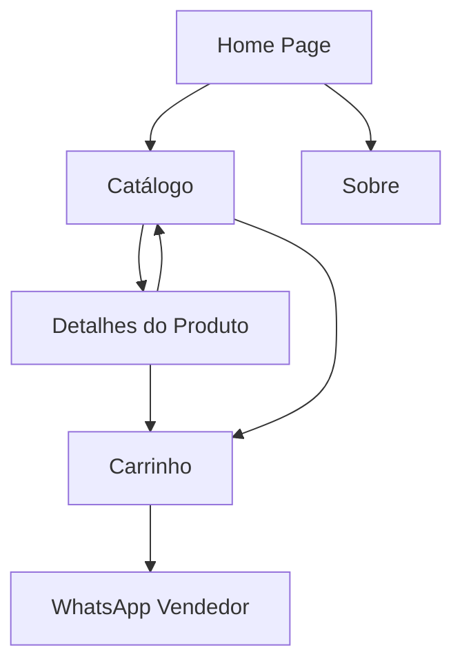

# PRD - Site Comercial Distribuidora Mirô

## 1. Product Overview

Site comercial B2B para a Distribuidora Mirô focado em vendas no atacado, com integração em tempo real ao catálogo de produtos e sistema de conversão via WhatsApp. O objetivo é aumentar o faturamento, expandir a presença digital e otimizar o processo de vendas através de uma plataforma profissional que conecta clientes diretamente aos vendedores.

## 2. Core Features

### 2.1 User Roles

| Role               | Registration Method        | Core Permissions                                                    |
| ------------------ | -------------------------- | ------------------------------------------------------------------- |
| Cliente Visitante  | Acesso direto sem cadastro | Navegar catálogo, visualizar produtos, adicionar ao carrinho        |
| Cliente Cadastrado | Email + dados da empresa   | Histórico de pedidos, lista de favoritos, acesso a preços especiais |

### 2.2 Feature Module

Nosso site da Distribuidora Mirô consiste nas seguintes páginas principais:

1. **Home page**: hero section com destaque da marca, navegação por categorias, produtos em destaque, informações de contato.
2. **Catálogo de produtos**: listagem completa com filtros por categoria, busca, ordenação por preço/nome, paginação.
3. **Detalhes do produto**: informações completas, imagens, especificações, quantidade disponível, botão de adicionar ao carrinho.
4. **Carrinho de compras**: lista de produtos selecionados, quantidades, total estimado, botão para enviar pedido via WhatsApp.
5. **Sobre a empresa**: informações institucionais, missão, valores, localização.

### 2.3 Page Details

| Page Name | Module Name             | Feature description                                                  |
| --------- | ----------------------- | -------------------------------------------------------------------- |
| Home page | Hero section            | Banner principal com logo, slogan e call-to-action para catálogo     |
| Home page | Categorias em destaque  | Grid com principais categorias de produtos (Ferramentas, etc.)       |
| Home page | Produtos populares      | Carrossel com produtos mais vendidos ou em promoção                  |
| Home page | Informações de contato  | Dados da empresa, telefone, endereço e horário de funcionamento      |
| Catálogo  | Lista de produtos       | Grid responsivo com imagem, nome, preço, estoque e botão "Adicionar" |
| Catálogo  | Filtros e busca         | Filtro por categoria, busca por nome, ordenação por preço/nome       |
| Catálogo  | Paginação               | Navegação entre páginas com controle de itens por página             |
| Detalhes  | Informações do produto  | Imagem ampliada, descrição completa, especificações técnicas         |
| Detalhes  | Controle de quantidade  | Seletor de quantidade com validação de estoque disponível            |
| Detalhes  | Ações do produto        | Botões para adicionar ao carrinho e comprar diretamente              |
| Carrinho  | Lista de itens          | Produtos selecionados com imagem, nome, quantidade e subtotal        |
| Carrinho  | Controles de quantidade | Aumentar/diminuir quantidade, remover item do carrinho               |
| Carrinho  | Finalização             | Botão para enviar pedido completo via WhatsApp para vendedor         |
| Sobre     | Informações da empresa  | História, missão, valores e diferenciais da Distribuidora Mirô       |
| Sobre     | Localização e contato   | Mapa, endereço, telefones e formulário de contato                    |

## 3. Core Process

**Fluxo Principal do Cliente:**

1. Cliente acessa o site e navega pelo catálogo de produtos
2. Utiliza filtros para encontrar produtos específicos por categoria ou busca
3. Visualiza detalhes do produto e adiciona itens ao carrinho
4. Revisa o carrinho e ajusta quantidades conforme necessário
5. Finaliza o pedido sendo redirecionado para WhatsApp do vendedor com lista completa
6. Vendedor recebe pedido formatado e inicia processo de fechamento da venda

**Algoritmo de Distribuição de Vendedores:**

* Atualmente: todos os pedidos direcionados para Thaynara (+55 67 9960-1031)

* Futuro: sistema de rodízio baseado em disponibilidade e especialização

## 4. User Interface Design

### 4.1 Design Style

* **Cores primárias**: Branco (#FFFFFF), Verde (#22C55E), Verde Escuro (#15803D)

* **Cores secundárias**: Cinza claro (#F3F4F6), Cinza escuro (#374151)

* **Tipografia**: Inter ou similar, tamanhos 14px (corpo), 18px (subtítulos), 24px+ (títulos)

* **Botões**: Estilo moderno com bordas arredondadas (8px), sombras sutis

* **Layout**: Grid responsivo, navegação superior fixa, cards para produtos

* **Ícones**: Outline style, consistentes com tema profissional

### 4.2 Page Design Overview

| Page Name | Module Name        | UI Elements                                                               |
| --------- | ------------------ | ------------------------------------------------------------------------- |
| Home page | Hero section       | Banner full-width com gradiente verde, logo centralizada, CTA em destaque |
| Home page | Categorias         | Cards 3x2 em desktop, 1x6 mobile, ícones representativos, hover effects   |
| Catálogo  | Grid de produtos   | Cards uniformes 4x3 desktop, 2x6 mobile, imagem 16:9, preço destacado     |
| Catálogo  | Filtros            | Sidebar esquerda desktop, drawer mobile, checkboxes e range sliders       |
| Detalhes  | Galeria de imagens | Imagem principal + thumbnails, zoom on hover, lightbox modal              |
| Carrinho  | Lista de itens     | Tabela responsiva, controles de quantidade inline, totais destacados      |
| Carrinho  | Resumo             | Card fixo com total, botão WhatsApp verde com ícone, animação pulse       |

### 4.3 Responsiveness

Site mobile-first com breakpoints em 768px (tablet) e 1024px (desktop). Otimizado para touch em dispositivos móveis com botões de pelo menos 44px, navegação por gestos e carregamento otimizado de imagens.

## 5. Integração com API

**Endpoint**: `https://fiscalfacil.com/LojaVirtual/14044/produtos/`

**Estrutura de dados identificada:**

* `cd_prd`: ID único do produto

* `nm_prd`: Nome do produto

* `ds_imagem`: URL da imagem

* `vl_vnd`: Preço de venda

* `qt_disponivel`: Quantidade em estoque

* `ds_tpoprd`: Categoria do produto

* `ds_marca`: Marca do produto

* `cd_un`: Unidade de medida

**Funcionalidades de integração:**

* Sincronização automática a cada 5 minutos

* Cache local para performance

* Fallback para dados offline em caso de falha na API

* Indicadores visuais de produtos em falta ou baixo estoque

## 6. Sistema de Carrinho e WhatsApp

**Funcionalidades do carrinho:**

* Persistência local (localStorage)

* Validação de estoque em tempo real

* Cálculo automático de totais

* Formatação de pedido para WhatsApp

**Integração WhatsApp:**

* Mensagem formatada com lista de produtos, quantidades e total

* Link direto: `https://wa.me/5567996010031?text=[PEDIDO_FORMATADO]`

* Template: "Olá! Gostaria de fazer o seguinte pedido: \[LISTA\_PRODUTOS] Total estimado: R$ \[VALOR]"

## 7. Métricas e Conversão

**KPIs principais:**

* Taxa de conversão (visitantes → pedidos WhatsApp)

* Valor médio do carrinho

* Produtos mais visualizados/adicionados

* Taxa de abandono do carrinho

* Tempo médio na página

**Otimizações para conversão:**

* Call-to-actions claros e destacados

* Indicadores de escassez ("Apenas X unidades")

* Produtos relacionados e sugestões

* Processo de checkout simplificado

* Carregamento rápido (<3s primeira página)

